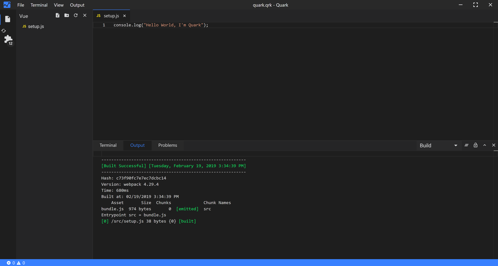

# Quark

[](https://travis-ci.org/Nishkalkashyap/Quark-electron)
[](https://ci.appveyor.com/project/Nishkalkashyap/quark-electron)
[](https://github.com/Nishkalkashyap/Quark-docs)


## The Repository

This repo is the development repo for the [Quark](https://quarkjs.io) product.

## Quark

<!--  -->
<video muted autoplay loop style="max-width:100%; height:auto" name="media" poster="./readme/hello-world-intro.png">
  <source src="./readme/hello-world-intro.mp4" type="video/mp4">
  Your browser does not support the video tag.
</video> 

Quark is a cross-platform, integrated development environment for rapidly building - functional , prototypal projects, written in HTML, CSS and JavaScript with native desktop app like capabilities.

## Goals

#### ⚡ Rapid prototyping and project development
Projects build with Quark should be easy and quick to setup.

#### 💻 Cross-platform
Projects build with Quark should run on all platforms such as Windows, Linux and Mac, sharing the same code base.

#### 🐱 Simplicity
Quark is built with simplicity in mind, so that creating projects with Quark is enjoyable, easy to learn, and accessible to just about anyone with basic programming skills.
<!-- 
## Bundled Packages
Quark includes a set of built-in packages. Namely
```json
{
    "@babel/core": "^7.4.5",
    "@babel/plugin-proposal-class-properties": "^7.4.4",
    "@babel/plugin-proposal-object-rest-spread": "^7.4.4",
    "@babel/plugin-syntax-dynamic-import": "^7.2.0",
    "@babel/preset-env": "^7.4.5",
    "@babel/preset-react": "^7.0.0",
    "@babel/preset-typescript": "^7.3.3",
    "@vue/web-component-wrapper": "^1.2.0",
    "babel-loader": "^8.0.6",
    "builtin-modules": "^3.1.0",
    "chart.js": "^2.8.0",
    "chokidar": "^2.1.6",
    "css-loader": "^2.1.1",
    "electron-log": "^3.0.5",
    "electron-store": "^3.2.0",
    "electron-updater": "^4.0.6",
    "extract-text-webpack-plugin": "^3.0.2",
    "firmata": "^2.0.0",
    "fs-extra": "^8.0.1",
    "html-loader": "^0.5.5",
    "ionic": "^4.12.0",
    "johnny-five": "^1.1.0",
    "markdown-it": "^8.4.2",
    "markdown-loader": "^5.0.0",
    "material-icon-theme": "^3.7.1",
    "memory-fs": "^0.4.1",
    "node-pty": "^0.8.1",
    "npm": "^6.9.0",
    "prop-types": "^15.7.2",
    "raw-loader": "^1.0.0",
    "react": "^16.8.6",
    "react-dom": "^16.8.6",
    "recursive-readdir": "^2.2.2",
    "serialport": "^7.1.5",
    "styled-components": "^4.2.0",
    "stylus": "^0.54.5",
    "stylus-loader": "^3.0.2",
    "ts-loader": "^5.4.5",
    "typescript": "^3.4.5",
    "url-loader": "^1.1.2",
    "vscode-languageserver-types": "^3.14.0",
    "vue": "^2.6.10",
    "vue-loader": "^15.7.0",
    "vue-style-loader": "^4.1.2",
    "vue-template-compiler": "^2.6.10",
    "webpack": "^4.32.2",
    "webpack-merge": "^4.2.1",
    "webpack-node-externals": "^1.7.2"
}
```
 -->


## Feedback

* Ask a question on Stack Overflow
* [File an issue](https://github.com/Nishkalkashyap/Quark-electron/issues)

## License
Copyright (c) Nishkal Kashyap. All rights reserved.

Licensed under the [GPL-3.0 license](https://github.com/Nishkalkashyap/Quark-electron/blob/master/LICENSE)