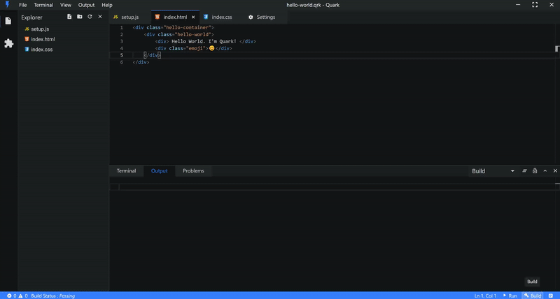
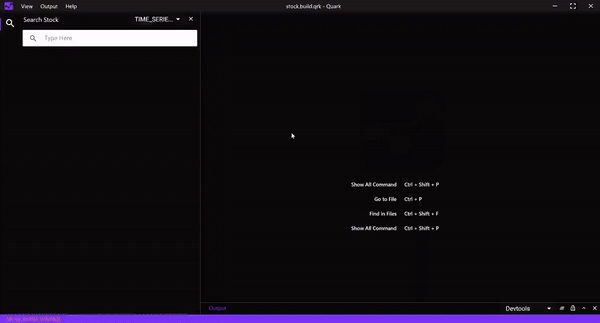
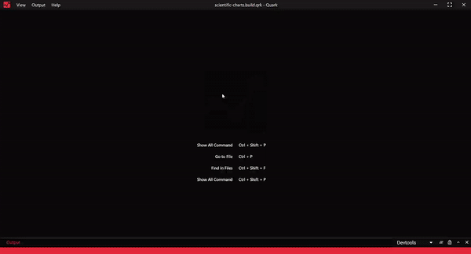
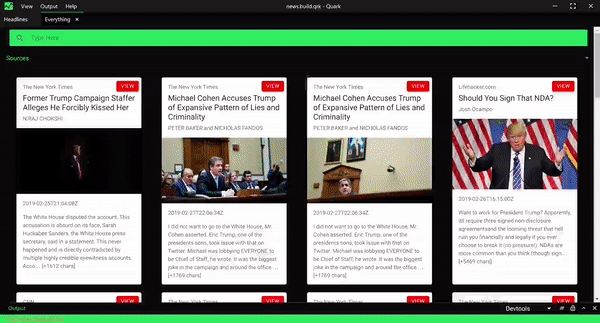
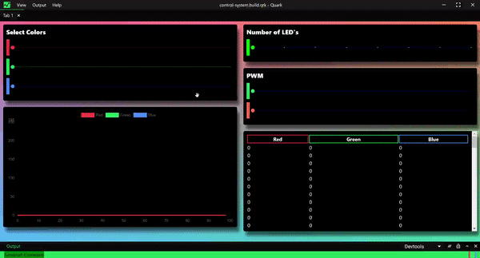

# Quark

[](https://travis-ci.org/Nishkalkashyap/Quark-electron)
[](https://ci.appveyor.com/project/Nishkalkashyap/quark-electron)
[](https://github.com/Nishkalkashyap/Quark-docs)


## The Repository

This repo is the development repo for the [Quark](https://quarkjs.io) product.

## Quark
Quark is a cross-platform, integrated development environment for rapidly building - functional , prototypal projects, written in HTML, CSS and JavaScript with native desktop app like capabilities.



## Goals

#### ⚡ Rapid prototyping and project development
Projects build with Quark should be easy and quick to setup.

#### 💻 Cross-platform
Projects build with Quark should run on all platforms such as Windows, Linux and Mac, sharing the same code base.

#### 🐱 Simplicity
Quark is built with simplicity in mind, so that creating projects with Quark is enjoyable, easy to learn, and accessible to just about anyone with basic programming skills.
<!-- 
## Bundled Packages
Quark includes a set of built-in packages. Namely
```json
{
    "@babel/core": "^7.4.5",
    "@babel/plugin-proposal-class-properties": "^7.4.4",
    "@babel/plugin-proposal-object-rest-spread": "^7.4.4",
    "@babel/plugin-syntax-dynamic-import": "^7.2.0",
    "@babel/preset-env": "^7.4.5",
    "@babel/preset-react": "^7.0.0",
    "@babel/preset-typescript": "^7.3.3",
    "@vue/web-component-wrapper": "^1.2.0",
    "babel-loader": "^8.0.6",
    "builtin-modules": "^3.1.0",
    "chart.js": "^2.8.0",
    "chokidar": "^2.1.6",
    "css-loader": "^2.1.1",
    "electron-log": "^3.0.5",
    "electron-store": "^3.2.0",
    "electron-updater": "^4.0.6",
    "extract-text-webpack-plugin": "^3.0.2",
    "firmata": "^2.0.0",
    "fs-extra": "^8.0.1",
    "html-loader": "^0.5.5",
    "ionic": "^4.12.0",
    "johnny-five": "^1.1.0",
    "markdown-it": "^8.4.2",
    "markdown-loader": "^5.0.0",
    "material-icon-theme": "^3.7.1",
    "memory-fs": "^0.4.1",
    "node-pty": "^0.8.1",
    "npm": "^6.9.0",
    "prop-types": "^15.7.2",
    "raw-loader": "^1.0.0",
    "react": "^16.8.6",
    "react-dom": "^16.8.6",
    "recursive-readdir": "^2.2.2",
    "serialport": "^7.1.5",
    "styled-components": "^4.2.0",
    "stylus": "^0.54.5",
    "stylus-loader": "^3.0.2",
    "ts-loader": "^5.4.5",
    "typescript": "^3.4.5",
    "url-loader": "^1.1.2",
    "vscode-languageserver-types": "^3.14.0",
    "vue": "^2.6.10",
    "vue-loader": "^15.7.0",
    "vue-style-loader": "^4.1.2",
    "vue-template-compiler": "^2.6.10",
    "webpack": "^4.32.2",
    "webpack-merge": "^4.2.1",
    "webpack-node-externals": "^1.7.2"
}
```
 -->

## Showcase 

A few projects made with Quark.

| System resource monitor [Download](https://dash.quarkjs.io/98ErmpQVApXvbsNWI6lvxLAAhpj2/_ybxmtnoilpu4nwj0t4/project) | Arduino data logger [Download](https://dash.quarkjs.io/98ErmpQVApXvbsNWI6lvxLAAhpj2/_6if0m0z5ol5inermo8/project) |
| -------------------------------------------------------------------------------------------------------------------- | ---------------------------------------------------------------------------------------------------------------- |
|                         |                                |
| Web Browser [Download](https://dash.quarkjs.io/98ErmpQVApXvbsNWI6lvxLAAhpj2/_0umm60gvnlierd0ku7/project)             | Activity monitor [Download](https://dash.quarkjs.io/98ErmpQVApXvbsNWI6lvxLAAhpj2/_y43pdal0kqgi99x5fh/project)    |
|                                    |                                   |
| Prices [Download](https://dash.quarkjs.io/98ErmpQVApXvbsNWI6lvxLAAhpj2/_cwub3h5x8ctfdt6rfs/project)                  | Hash [Download](https://dash.quarkjs.io/98ErmpQVApXvbsNWI6lvxLAAhpj2/_roomlkgizmk1nzc7of/project)                |
|                                  |                                               |


<!-- 
| System resource monitor                                               | Arduino data logger                                             |
| --------------------------------------------------------------------- | --------------------------------------------------------------- |
|   |  |
| Stock analyzing app                                                   | Plot Charts                                                     |
|  |            |
| News App                                                              | Web Browser                                                     |
|                        |            |
-->


<!-- 
#### System resource monitor
Monitors system resources. View CPU loads, memory usage, process explorer.


#### Digital control systems
Digital control system made with Arduino UNO using pre-installed serialport library.




#### Plot Charts
Plot charts using plotly.js


#### Stock analyzing app
Analyze historic/real-time stock data.


#### News App
News app with multiple country and source filter.


#### Web Browser
Web browser with multiple split view support.


 -->

## Feedback

* Ask a question on Stack Overflow
* [File an issue](https://github.com/Nishkalkashyap/Quark-electron/issues)

## License
Copyright (c) Nishkal Kashyap. All rights reserved.

Licensed under the [GPL-3.0 license](https://github.com/Nishkalkashyap/Quark-electron/blob/master/LICENSE)