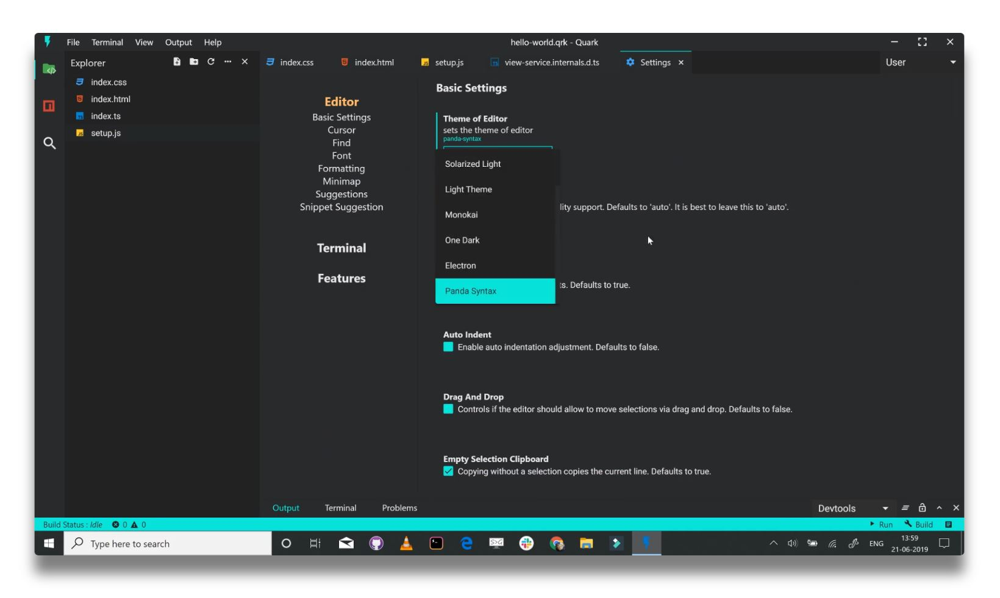
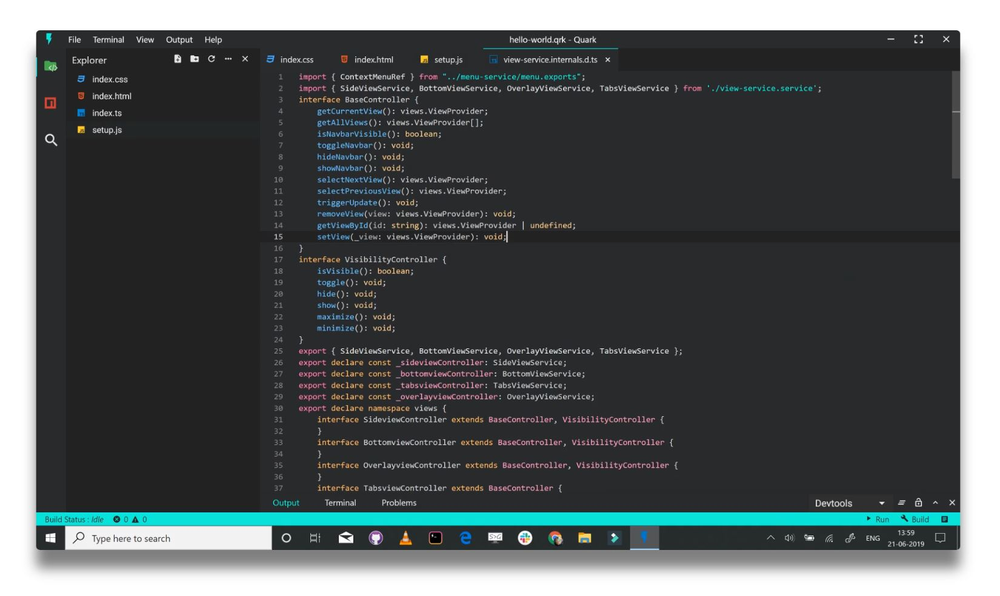
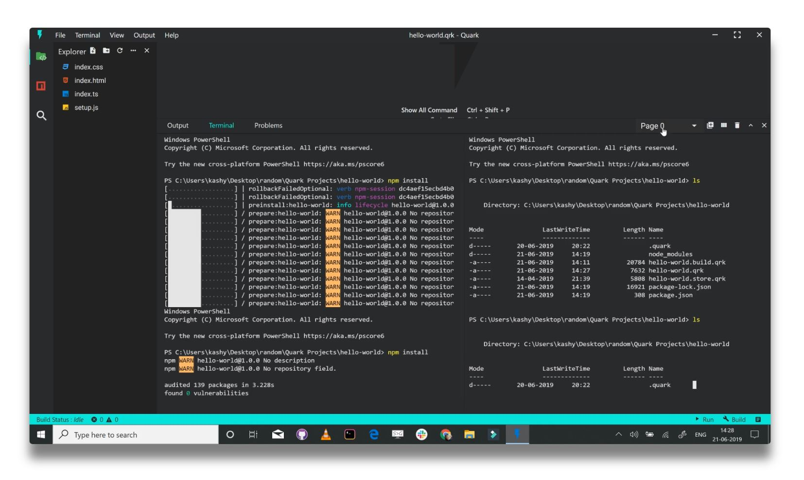
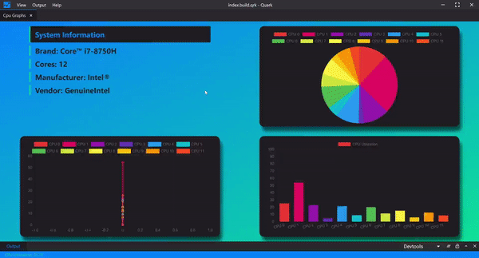
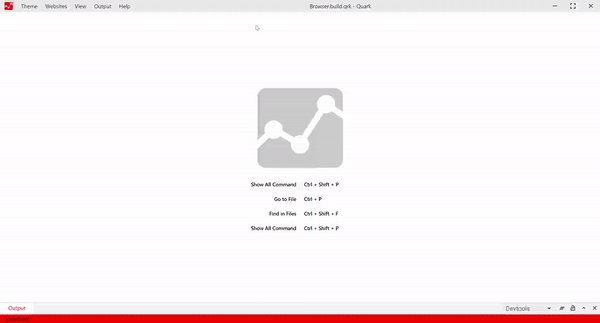

# Quark

Quark is a general purpose software tool specifically designed to help you create projects written in HTML, CSS and JavaScript with native desktop app like capabilities. Quark apps run on Mac, Windows, and Linux from a single codebase.

Visit [the website](https://quarkjs.io) to learn more.

## Goals

#### ⚡ Rapid prototyping and project development
Projects build with Quark should be easy and quick to setup.

#### 💻 Cross-platform
Projects build with Quark should run on all platforms such as Windows, Linux and Mac, sharing the same code base.

#### 🐱 Simplicity
Quark is built with simplicity in mind, so that creating projects with Quark is enjoyable, easy to learn, and accessible to just about anyone with basic programming skills.

## Showcase 
A few apps built with Quark

#### Check out these sample apps from [Quark appstore](https://quarkjs.io)
* [System resource monitor](https://dash.quarkjs.io/98ErmpQVApXvbsNWI6lvxLAAhpj2/_ybxmtnoilpu4nwj0t4/project) - Monitors system resources. View CPU loads, memory usage, process explorer.
* [Web Browser](https://dash.quarkjs.io/98ErmpQVApXvbsNWI6lvxLAAhpj2/_0umm60gvnlierd0ku7/project) - Web browser with multiple tabs, split view support.
* [Activity Monitor](https://dash.quarkjs.io/98ErmpQVApXvbsNWI6lvxLAAhpj2/_y43pdal0kqgi99x5fh/project) - Simple app that shows a doughnut chart of the CPU system, user, and idle activity time.
* [Arduino Data logger](https://dash.quarkjs.io/98ErmpQVApXvbsNWI6lvxLAAhpj2/_6if0m0z5ol5inermo8/project) - Create a dashboard and a data logger for Arduino.
* [Hash](https://dash.quarkjs.io/98ErmpQVApXvbsNWI6lvxLAAhpj2/_roomlkgizmk1nzc7of/project) - Simple app that shows the hash values of entered text using different algorithms.
* [Mirror](https://dash.quarkjs.io/98ErmpQVApXvbsNWI6lvxLAAhpj2/_gnk42qk7gepvshsva1/project) - Simple app that plays a video of the computer's camera at a maximized size like looking into a mirror.
* [Stock prices](https://dash.quarkjs.io/98ErmpQVApXvbsNWI6lvxLAAhpj2/_cwub3h5x8ctfdt6rfs/project) - Simple app that shows the current price of oil, gold, and silver using the STOOQ API.

## Feedback

* [File an issue](https://github.com/Nishkalkashyap/Quark-electron/issues)
* Ask a question on Stack Overflow

## License
Copyright (c) Nishkal Kashyap. All rights reserved.

Licensed under the [GPL-3.0 license](https://github.com/Nishkalkashyap/Quark-electron/blob/master/LICENSE)